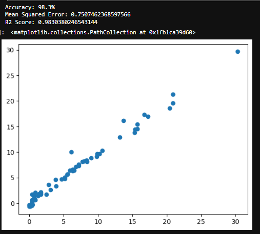
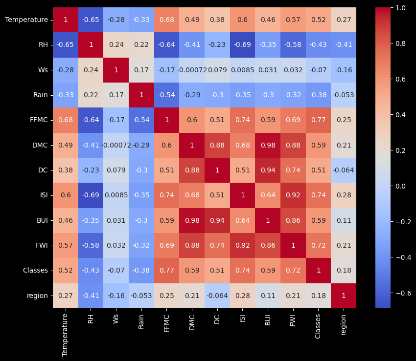
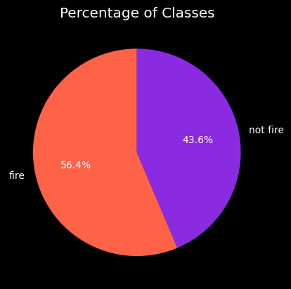
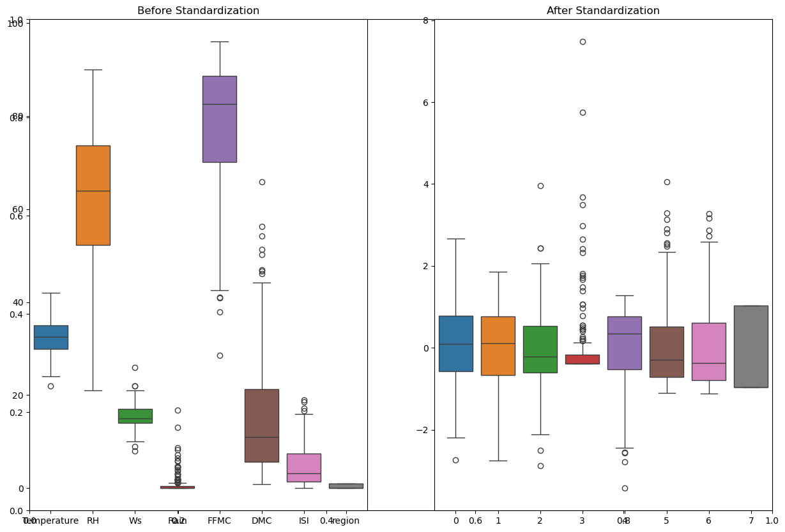
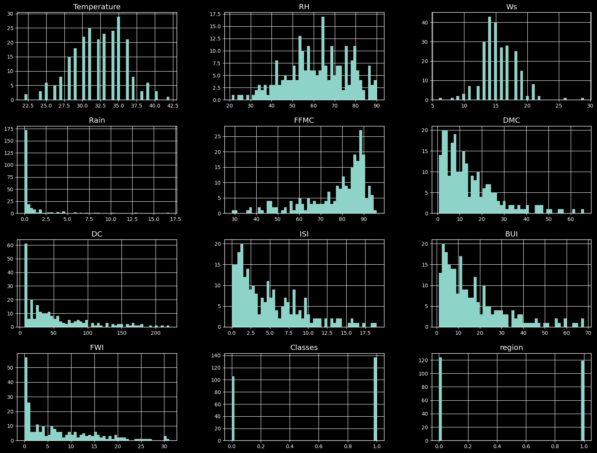

# Algerian Forest Fires Based Modelling

## Overview
This project aims to predict the **Fire Weather Index (FWI)**, which ranges from **0 to 31.1**, using machine learning techniques. The **FWI** is a crucial component in assessing forest fire risk. The project also serves as a case study to understand the complete lifecycle of constructing an ML model.

---

## Motive of the Project
The primary goal of this project is to gain a thorough understanding of the **end-to-end machine learning model lifecycle**, including data preprocessing, exploratory data analysis (EDA), model training, evaluation, and deployment.

---

## Tools and Technologies Used
- **Programming Language**: Python
- **Libraries**:
  - Pandas
  - NumPy
  - scikit-learn
- **Framework**: Flask
- **Hosting Platform**: AWS Elastic Beanstalk

---

## Dataset
The dataset is sourced from the [UCI Machine Learning Repository](https://archive.ics.uci.edu/dataset/547/algerian+forest+fires+dataset).

### Dataset Description:
1. **Source**: Data from two regions in Algeria:
   - **Bejaia region** (northeast)
   - **Sidi Bel-abbes region** (northwest)
2. **Time Period**: June 2012 to September 2012.
3. **Instances**: 244 (122 from each region).
4. **Attributes**:
   - **Date**: (Day, Month, Year)
   - **Weather Observations**:
     - Temperature (`Temp`): 22 to 42 °C
     - Relative Humidity (`RH`): 21% to 90%
     - Wind Speed (`Ws`): 6 to 29 km/h
     - Rainfall (`Rain`): 0 to 16.8 mm
   - **FWI Components**:
     - Fine Fuel Moisture Code (`FFMC`): 28.6 to 92.5
     - Duff Moisture Code (`DMC`): 1.1 to 65.9
     - Drought Code (`DC`): 7 to 220.4
     - Initial Spread Index (`ISI`): 0 to 18.5
     - Buildup Index (`BUI`): 1.1 to 68
     - Fire Weather Index (`FWI`): 0 to 31.1
   - **Target Variable**: Class (Fire or Not Fire)

### Dataset Findings:
- Fires were predominantly observed in **July, August, and September** across both regions.
- The dataset includes **138 Fire** and **106 Not Fire** instances.

---

## Approach

### Data Preprocessing
- Dropped **Day**, **Month**, and **Year** columns as they do not contribute to predicting the FWI.
- Merged datasets from the two regions to improve model generalization.

### Models Tested
- **Linear Regression**
- **Ridge Regression**
- **RidgeCV**
- **Lasso Regression**
- **LassoCV**
- **ElasticNet**

### Final Model
- **Linear Regression**
  - **Accuracy**: 98.3%
  - **Mean Squared Error (MSE)**: 0.75
- **Reason for Selection**: Best performance with minimal error.

---

## Hosting
The application is hosted on **AWS Elastic Beanstalk**, allowing users to interact with the model via a Flask-based web interface.

---

## Key Insights
- **July, August, and September** are peak months for forest fires.
- **Temperature**, **Relative Humidity**, and **Wind Speed** significantly influence fire occurrence and intensity.

---

## Project Workflow
1. **Exploratory Data Analysis (EDA)**: Data visualization and pattern discovery.
2. **Data Preprocessing**: Cleaning and preparing the dataset.
3. **Model Development**: Training and testing various regression models.
4. **Model Evaluation**: Selecting the best-performing model based on accuracy and error metrics.
5. **Deployment**: Deploying the model using Flask and AWS Elastic Beanstalk.

---
## Dataset License
This dataset is licensed under the **ODC Public Domain Dedication and Licence (PDDL)**.

## References
- **Dataset**: [UCI Machine Learning Repository - Algerian Forest Fires Dataset](https://archive.ics.uci.edu/dataset/547/algerian+forest+fires+dataset)
